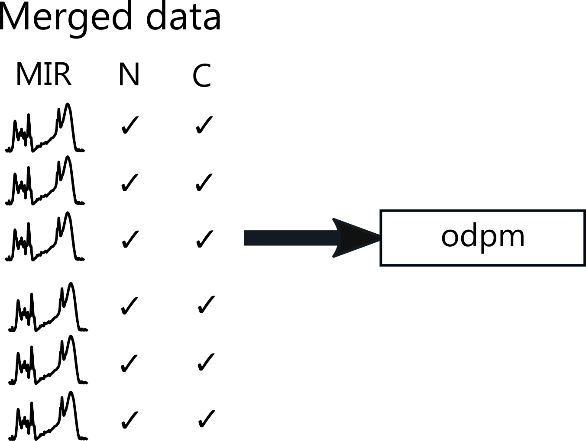

```{r, include = FALSE}
knitr::opts_chunk$set(
  collapse = TRUE,
  comment = "#>",
  echo = FALSE
)
```

pmird is part of my PhD project. One of my goals is to facilitate data integration into dynamic peatland models to model long-term carbon accumulation. For this reason, I plan to develop a suite of **calibration models** that help to predict various peat properties from mid infrared spectra.

The mid infrared spectra and additional data on peat properties will be used to construct and validate these models.

I will **publish these models** so that future projects can benefit from their capabilities. For this, I've created the R package [irpeat](https://github.com/henningte/irpeat/).

Moreover, I will use these models to **cross-link different data sets to create a unique compendium of peat properties**. The principle is quite easy: If someone provides mid infrared spectra and data on peat nitrogen content, I can develop a calibration model for this. Likewise if you provide for example mid infrared spectra and carbon content data, I construct a calibration model for this. Finally, I can use both models to predict the N and C content in your and his/her samples, respectively.

```{r cross-linking, include=TRUE, out.width="65%", fig.align="center"}

```

In addition, I plan to develop an open dynamic peatland model and I will use the data in pmird also to construct and validate this model. The aim is to provide an open and easily accessible mechanistic model for long-term carbon accumulation in peatlands that can be used by other scientists, for example to discover new hypotheses. <!-- See the [GitHub repository for odpm]() if you are interested.-->

```{r odpm, include=TRUE, out.width="35%", fig.align="center"}

```

Since these tasks are a core part of my PhD project and I am expected to contribute the main part to it, there is only a limited extent to which collaborations on this work are possible.
